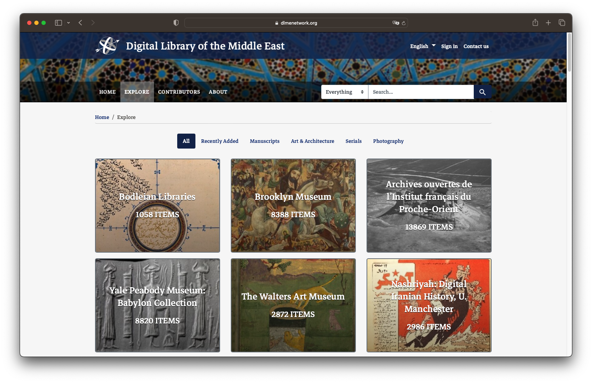
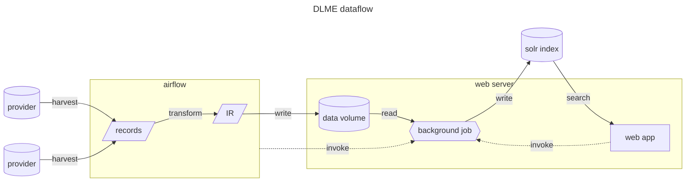

# Digital Library of the Middle East
[](https://github.com/sul-dlss/dlme/actions/workflows/ruby.yml)
[](https://github.com/sul-dlss/dlme/releases)
[](https://opensource.org/licenses/Apache-2.0)

<p align="center">Free and open access to the rich cultural legacy of the Middle East and North Africa via curated collections from a wide range of cultural heritage institutions.</p>


## Overview
The DLME ecosystem is composed of an ETL pipeline and a Ruby on Rails web application.

The ETL pipeline uses [Apache Airflow](https://airflow.apache.org/) to harvest resources from provider institutions (see [dlme-airflow](https://github.com/sul-dlss/dlme-airflow)) and [traject](https://github.com/traject/traject) to transform them into a common "intermediate representation" ("IR", see [dlme-transform](https://github.com/sul-dlss/dlme-transform)) before they are indexed into an [Apache Solr](https://solr.apache.org/) instance.

The web application (this repository) is a [Spotlight](https://github.com/projectblacklight/spotlight) instance hosting a single exhibit, which provides a user interface for searching and browsing the records. It also provides administrative functionality and logic for background jobs to index records into Solr.



For a detailed view of the project's infrastructure, including deployed environments, see the [devops documentation](https://github.com/sul-dlss/DevOpsDocs/blob/master/projects/dlme/operations-concerns.md). For a historical overview of DLME architecture and its data format, see the [data documentation](docs/README.md).
## DLME's use of Spotlight
In addition to using many out of the box features of Spotlight, such as the creation and management of exhibit pages and support seaching and browsing across exhibit items, the DLME web application also includes extensions to and customizations of Spotlight functionality.  The DLME web application incorporates multi-language support.  For example, the user's choice of English or Arabic as the display language results in the appropriate language fields to be displayed from the same Solr document.   In addition, the DLME web app includes specific connection points with the ETL pipeline (as described above and shown in the diagram). 
## Local Development
In production, the DLME web application depends on several services:
  * A postgres database to store data on users, pages, and collections
  * A Solr index to store the metadata for items and search for them
  * A Redis instance to use as both a cache and a backend for background jobs

Locally, the app can run in a standard Ruby/Rails environment using SolrWrapper, sqlite3, etc. to simplify development. Alternatively, the services can be run in Docker containers using docker-compose.
### Without Docker

In order to not have to use Postgres locally (and use sqlite for for development), you'll want to bundle install without the production dependencies.

```bash
bundle install --without production
```

You can run the standard Rails setup script which will run your database migrations, etc.

```bash
./bin/setup
```

To start Solr, you can use the `solr_wrapper` command.

```bash
solr_wrapper
```

Start the Rails app

```bash
bin/dev
```

You can create an admin user to login to the application by running Spotlight's `initialize` task.

```bash
bin/rails spotlight:initialize
```

Index some data:
  1. get a data file from the server's datadir such as `output-aims.ndjson`
  1. `bin/rails runner "AddResourcesJob.perform_now('output-aims.ndjson', exhibit: Spotlight::Exhibit.first, local: true)"`
### With Docker
See [docker-compose.yml](docker-compose.yml) for the full list of services and their configuration. The following instructions assume you have [docker](https://docs.docker.com/get-docker/) and [docker-compose](https://docs.docker.com/compose/install/) installed.

#### Stopping and starting
You can stop the entire stack with:
```sh
docker compose down
```
This process will gracefully stop and remove all running containers. Data is persisted in the form of volumes, and won't be removed. To start the stack back up again:
```sh
docker compose up     # add -d to run in the background and silence logs
```
You can stop and start individual containers by referring to them by their service name from `docker-compose.yml`:
```sh
docker compose stop solr
```
For more, see the [`docker compose` CLI reference](https://docs.docker.com/compose/reference/#command-options-overview-and-help).

#### Managing data
Data for the solr and redis services are persisted using docker named volumes. You can see what volumes are currently present with:
```sh
docker volume ls
```
If you want to remove a volume (e.g. to start with a fresh database or solr core), you can do:
```sh
docker volume rm dlme_solr-data   # to remove the solr data
```
### Writing tests
#### Adding fixture data

Fixture data for tests can be found in `spec/fixtures/json`. These json objects represent Solr records. Each `.json` file within this directory must contain *a single record object* only. Multiple objects in an array will not work (`[{...}, {...}]`). 

## Data
All files must first be converted to the intermediate representation (IR) before they can be imported. This is done by the https://github.com/sul-dlss/dlme-transform repository in our deployed environments. Once the IR is generated and stored on the shared filesystem, there are three main ways to index it into the web application:

1. POST the file path to the `/api/harvests` endpoint, which will initiate a new indexing background job (this is what Airflow does)
2. Navigate to `/library/resources/new` and enter the local path to the file in the "URL" field, then click "Fetch" (this is how data is loaded in production)
3. Manually run the `AddResourcesJob` in the Rails console (see the section on local development above)

There is also a mechanism for allowing users to copy and paste JSON directly into a textarea form field, which is purely for testing and development. **WARNING**: Data that flows in via this mechanism is *not* validated per the DLME JSON schema. This ability is disabled by default in production-like environments and may be turned on by flipping `Settings.feature_flags.allow_json_upload` to `true`. (It is enabled by default in the docker-compose service and in the test suite.)

Metadata coded as JSON IR should be loaded as `DlmeJson` resources in the database.
At this point they can be indexed into Solr for discovery.
